# I'm algosul

System programming enthusiasts

## 🛠️ Stack

I Don't like Python & Java & JS.

<picture>
  <source
    srcset="profile/top-langs-dark.svg"
    media="(prefers-color-scheme: dark)"
  />
  <source
    srcset="profile/top-langs.svg"
    media="(prefers-color-scheme: light), (prefers-color-scheme: no-preference)"
  />
  
</picture>

## 📈 My GitHub Stats

<picture>
  <source
    srcset="profile/stats-dark.svg"
    media="(prefers-color-scheme: dark)"
  />
  <source
    srcset="profile/stats.svg"
    media="(prefers-color-scheme: light), (prefers-color-scheme: no-preference)"
  />
  
</picture>

## 💻 Working Environment

### IDE

### OS

